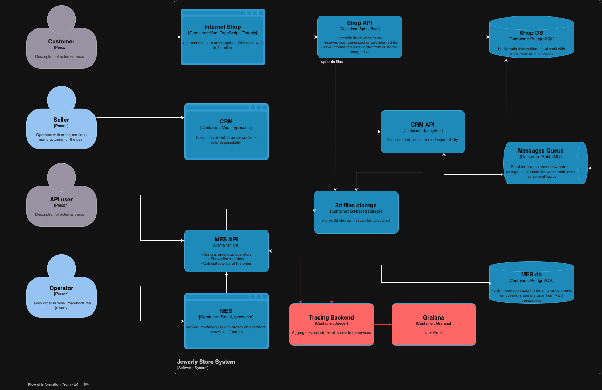

# Архитектурное решение по трейсингу

## Мотивация

Текущая архитектура не позволяет понять, где именно "зависает" заказ:
- Статусы обновляются в разных системах (магазин, CRM, MES).
- Нет централизованной информации о прохождении заказа по цепочке.
- Заказы теряются при передаче через RabbitMQ.
- Трудно восстановить историю событий по конкретному заказу.

Внедрение распределённого трейсинга:
- Позволит отследить путь заказа сквозь все микросервисы и очереди.
- Поможет быстрее находить причины задержек и потерь.
- Улучшит SLA, сократит время реакции на инциденты.
- Упростит диагностику проблем и ускорит их устранение.

## Системы, которые следует покрыть трейсингом

- Онлайн-магазин (Java Spring Boot)
- CRM (Java Spring Boot)
- MES (C#)
- RabbitMQ (обмен сообщениями)
- Службы расчёта, обновления статусов, взаимодействия с БД

## Данные, которые должны попадать в трейсинг

- `trace_id`, `span_id`, `parent_span_id`
- Время начала и окончания запроса
- Имя сервиса
- Статус (успешно / ошибка)
- Контекст заказа: `order_id`, `user_id`, `status`
- Тип запроса: HTTP / RabbitMQ / БД
- Ошибки и исключения (если есть)

## Предлагаемое решение

- Внедрить **OpenTelemetry** во все сервисы:
  - Spring Boot: с помощью `opentelemetry-javaagent`
  - C#: через `OpenTelemetry-dotnet`
- Использовать **Jaeger** или **Grafana Tempo** как хранилище трейсинга.
- Все входящие HTTP-запросы, вызовы к RabbitMQ и БД — с propagation `trace-id`.
- В RabbitMQ передавать `trace-id` в заголовках сообщений.
- Отображение данных — через Grafana (с подключённым трейсингом).

**Диаграмма C4 (обновлённая)**  

🔗 [Ссылка на доработанную схему с трейсингом (Jaeger)](./jewerly_c4_model-tracing.drawio)

## Компромиссы

- MES на C# требует отдельной настройки трассировки.
- OpenTelemetry может дать небольшую нагрузку на сервисы.
- Сложности интеграции с RabbitMQ (нужна поддержка trace-id в заголовках).
- Не все сторонние библиотеки поддерживают автоматический трейсинг.

## Безопасность

- Доступ к системе трейсинга только по VPN / с корпоративных IP.
- Аутентификация через SSO / роли (например, "Поддержка", "DevOps").
- Ограничение времени хранения (например, 7–14 дней).
- Исключение персональных данных из трейсинга (PII не логируем).

## Дополнительное задание — автоматический мониторинг и алертинг

- Использовать Grafana Alerts по trace duration:
  - Алёрт, если прохождение заказа > 15 мин
  - Алёрт, если пропущен шаг (например, нет перехода от SUBMITTED к PRICE_CALCULATED за X минут)
- Сценарий:
  - Заказ отслеживается системой.
  - Если в течение заданного интервала нет перехода по цепочке — создаётся тикет + Slack-уведомление.

