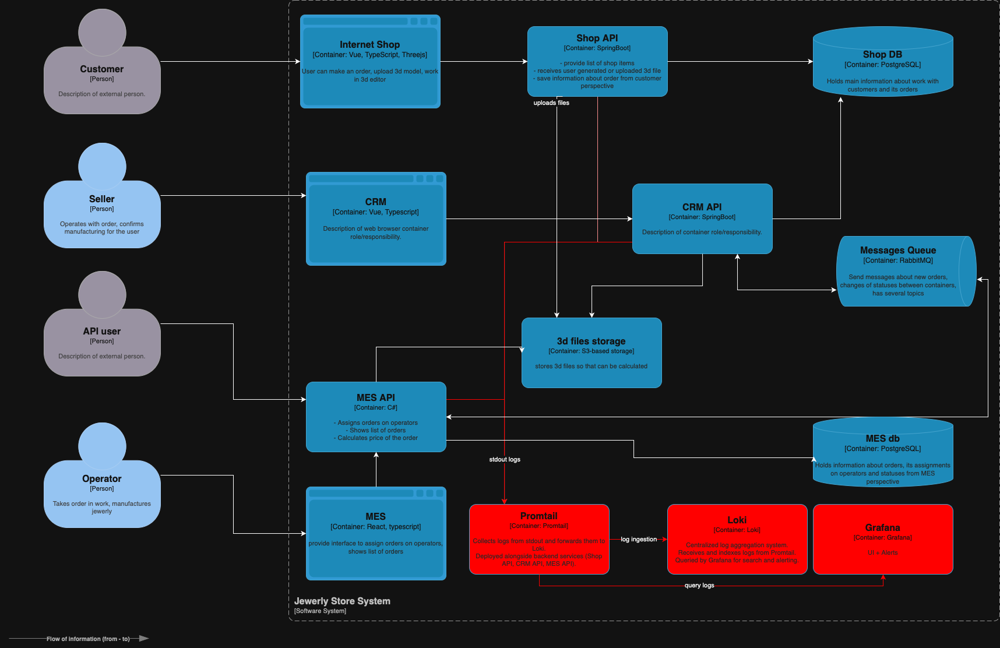

# Архитектурное решение по логированию

## Мотивация

На текущий момент система не предоставляет централизованного доступа к логам. Разработчики и поддержка вынуждены вручную восстанавливать цепочку событий по жалобам пользователей. Это приводит к:

- Потере времени на анализ инцидентов.
- Высокой нагрузке на команду поддержки.
- Невозможности эффективно реагировать на сбои в продакшене.
- Отсутствию автоматической диагностики и анализа ошибок.

Внедрение логирования:
- Позволит фиксировать ключевые действия (например, смену статуса заказа).
- Поможет быстрее устранять баги.
- Улучшит стабильность системы и качество поддержки клиентов.
- Даст базу для автоматического анализа и алертинга.

## Какие логи собирать и откуда

**Системы:**
- Онлайн-магазин (Java Spring Boot)
- CRM (Java Spring Boot)
- MES (C#)
- RabbitMQ (по возможности)
- Инфраструктура и БД (через экспорт логов)

**Логи уровня INFO:**
- Изменение статуса заказа: order_id, user_id, новый статус, timestamp.
- Получение / отправка сообщений в RabbitMQ: message_id, source, destination.
- Авторизация пользователя (без паролей): user_id, role.
- Начало и завершение расчёта стоимости: время старта и окончания, order_id.
- Ошибки обработки заказа или сообщения.

**Уровень DEBUG:**
- Временные включения для анализа сложных кейсов (опционально через флаги).

**Уровень ERROR:**
- Исключения, фатальные сбои, тайм-ауты, сбои в очередях и базах данных.

## Приоритетность внедрения

1. MES — основная зона проблем и жалоб.
2. RabbitMQ — пропадают сообщения.
3. Онлайн-магазин и CRM — далее по значимости.

## Предлагаемое решение

- Внедрить систему сбора логов на базе **Loki + Grafana + Promtail**:
  - Простой в настройке стек, хорошо интегрируется с Prometheus.
- Для Java — использовать `Logback` с экспортом в stdout + Promtail.
- Для C# — использовать `Serilog` + sink для stdout + Promtail.
- Хранение логов в Loki с разграничением по системе, уровню и order_id.
- Настроить алерты по ERROR и определённым шаблонам логов.

**Диаграмма C4 (обновлённая)**

🔗 [Ссылка на доработанную схему с логированием (Loki)](./jewerly_c4_model-logging.drawio)

## Политика безопасности

- Исключение из логов персональных данных (телефон, email, имя).
- Доступ к логам — только по VPN, авторизованные роли: DevOps, поддержка.
- Хранение логов — до 30 дней, с возможностью выгрузки архивов.

## Политика хранения

| Система  | Индекс    | Срок хранения |
|----------|-----------|---------------|
| MES      | mes-logs  | 30 дней       |
| Shop     | shop-logs | 14 дней       |
| CRM      | crm-logs  | 14 дней       |
| RabbitMQ | mq-logs   | 7 дней        |

## Анализ логов

- Настроить шаблоны для поиска:
  - “order_id=XXX error”
  - “timeout” + “service_name”
  - “status change failed”
- Настроить алерты по количеству логов уровня ERROR > 10 за 5 минут.
- Настроить шаблоны поиска аномалий (например, резкое увеличение количества заказов).

## Доп задание: критерии выбора технологии

| Критерий                | ELK                 | OpenSearch | Loki       | Splunk        |
|-------------------------|---------------------|------------|------------|---------------|
| Лицензия                | Elastic             | Apache 2.0 | Apache 2.0 | Проприетарная |
| Простота настройки      | Средняя             | Средняя    | Высокая    | Низкая        |
| Интеграция с Prometheus | Посредственно       | Хорошо     | Отлично    | Средне        |
| Требования к ресурсам   | Высокие             | Высокие    | Низкие     | Высокие       |
| Стоимость               | Бесплатно (условно) | Бесплатно  | Бесплатно  | Дорого        |

**Вывод:** Loki — оптимальный выбор для команды с ограниченными ресурсами и уже существующим стеком Prometheus + Grafana.

