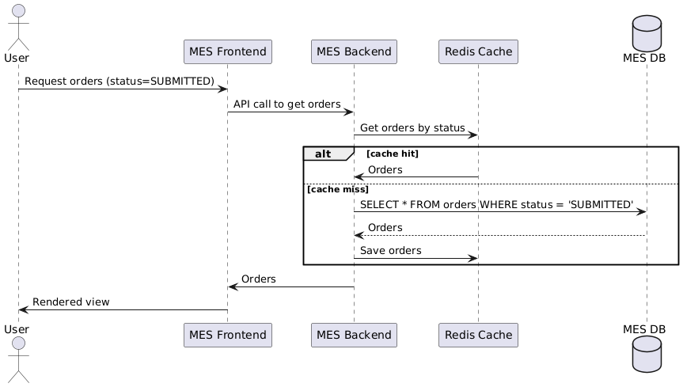
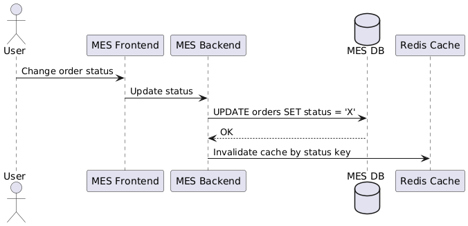

# Архитектурное решение по кешированию

## Мотивация

Сейчас операторы жалуются на медленную работу MES. Основные проблемы:
- Долгая загрузка дашборда заказов.
- Высокая нагрузка на базу данных MES.
- Повторные расчёты стоимости заказа перегружают систему.

Цель кеширования:
- Снизить нагрузку на MES.
- Ускорить загрузку данных на дашборде.
- Повысить отзывчивость интерфейса и масштабируемость системы.

## Предлагаемое решение

### Компоненты для кеширования:

1. **Список заказов на дашборде MES**
   - Серверное кеширование на стороне MES.
   - Хранить последние N заказов по статусам.

2. **Результаты расчётов стоимости**
   - Повторно не пересчитывать, если входная модель не изменилась.

### Тип кеширования

- **Серверное кеширование** — более эффективно в условиях SPA-приложения и централизованного API.

### Паттерн кеширования

- **Cache-Aside (lazy caching)**:
  - Данные читаются из кеша.
  - Если не найдено — загружаются из БД и записываются в кеш.
  - Инвалидация происходит при изменении статуса заказа.

**Почему не другие:**
- Write-Through создаёт лишнюю нагрузку при изменениях.
- Refresh-Ahead требует точного предсказания времени запроса — сложно реализовать.

### Диаграмма последовательности

Операция: Загрузка заказов на дашборде MES

Операция: Изменение статуса заказа

### Стратегия инвалидации

- **По ключу**: кеш сбрасывается при любом изменении статуса заказа.
- **TTL (дополнительно)**: на случай, если инвалидация не сработала.

| Стратегия   | Преимущества               | Недостатки                       |
|-------------|----------------------------|----------------------------------|
| По ключу    | Простота, высокая точность | Требует логики очистки           |
| TTL         | Резервный механизм         | Может отдавать устаревшие данные |
| Программная | Тонкая настройка           | Сложность реализации             |

### Технологии

- Redis как основной кеш.
- Spring Cache (для Java) или StackExchange. Redis (для C#).
- Отслеживание кеш-хитов/промахов — через метрики Prometheus.

### Заключение

Реализация Cache-Aside с Redis позволит быстро разгрузить MES и значительно улучшить UX для операторов. При необходимости можно расширить кеш на CRM и онлайн-магазин.

